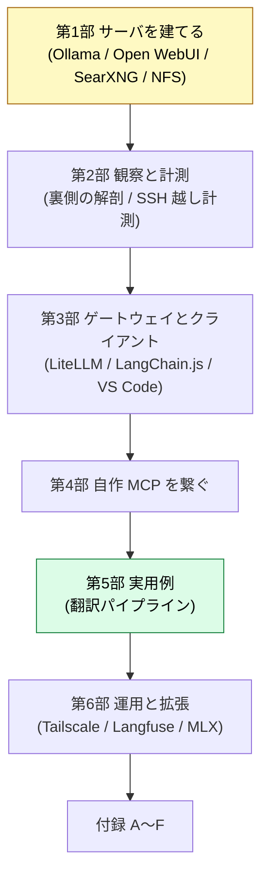

:::message
**この章でできるようになること**: 本書をどの順で読むと効率がよいか（推奨ルート）と、読み終えた後の次の一歩がわかる。
:::

ここまでお疲れさまでした。この巻末では、目的別のおすすめルートと、本書の先に進むための足がかりをまとめます。途中から読み始めた方は、ここを先に見てから戻っても構いません。

## 全体マップ

## 目的別の推奨ルート

| 目的 | おすすめルート |
| --- | --- |
| まずサーバを使い始めたい | 第1部 → （必要なら）第5部 実用例 |
| エージェント開発まで通したい | 第1部 → 第2部 → 第3部 → 第4部 |
| 運用・安定性を固めたい | 第1部 → 第2部（計測）→ 第6部 |
| 翻訳など具体的な用途が目的 | 第1部（最小）→ 第5部 |

第 1 部はどのルートでも共通の土台です。第 4・6 部には構想段階の章が含まれます。

## 各章の読み方（約束ごと）

- **各章の冒頭**に「この章でできるようになること」が 1 行で置かれています。まずそこだけ拾えば、読むかどうか判断できます。
- **各章の前提**（先に終えておくべき章）を明示しています。
- **章の状態マーク**: ✅ 検証済み / 🟡 実験的に確認 / 🚧 未着手・構想。🚧 は手順より「判断の枠組み」として読んでください。
- 手順そのものは環境やバージョンで変わります。**「なぜその選定・設定なのか」という判断軸**のほうを持ち帰ると、別の環境でも応用できます。

## 次の一歩

本書はローカルで「動くもの」を建てる視点に絞っています。ここから先、より長く効く知識へ進みたい場合の入口を挙げておきます。

- **設計の抽象度を上げる**: エージェント / RAG / Memory の設計判断 → 付録 B（L3 リンク早見表）
- **原理に降りる**: Transformer / Context Window などの構造的制約 → 付録 C（L4 リンク早見表）
